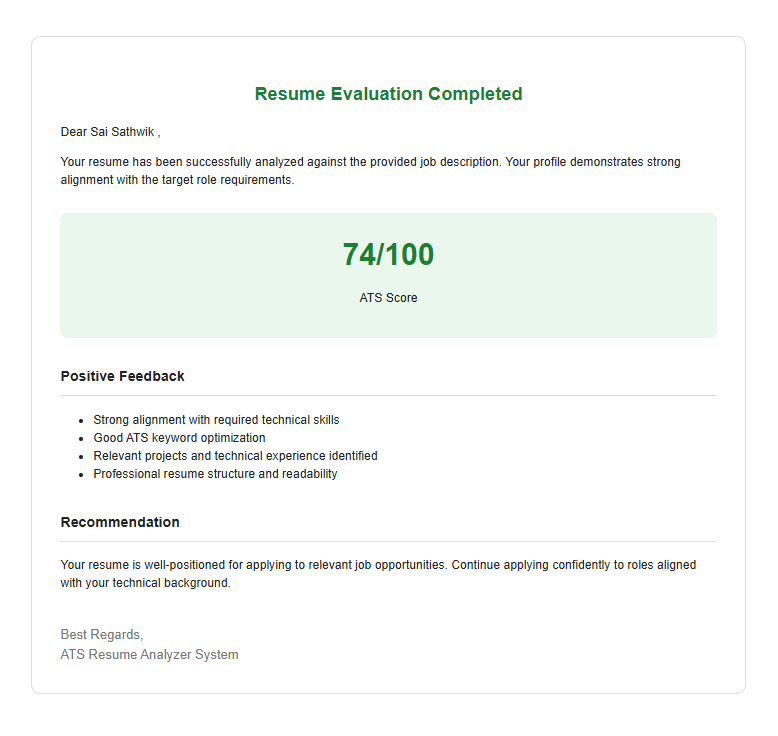
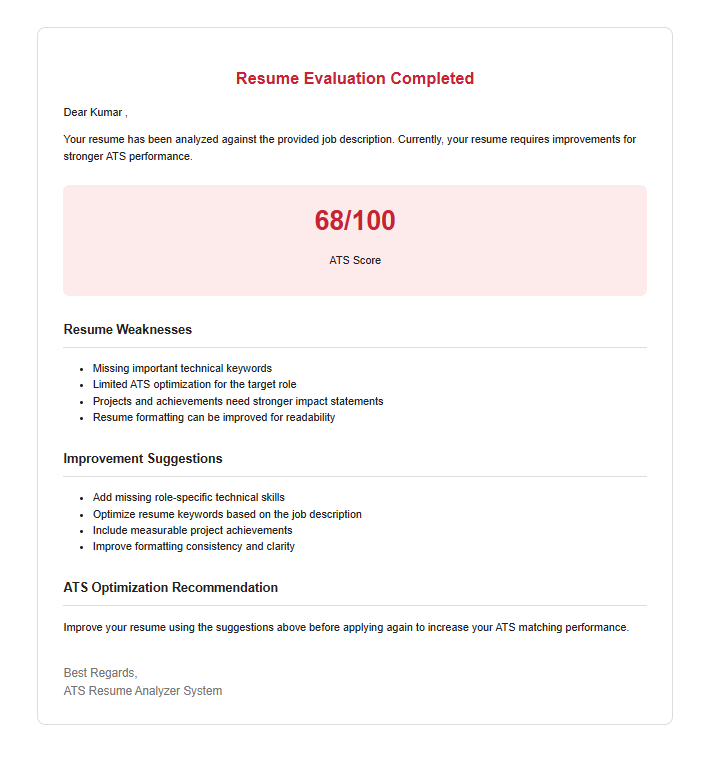

## AI Resume Analyzer

## Overview

AI Resume Analyzer is an AI-powered automation system that analyzes uploaded resumes using Google Gemini AI and generates ATS (Applicant Tracking System) scores automatically.The system evaluates resumes by matching resume content with job descriptions, generates ATS scores out of 100, provides personalized feedback and improvement suggestions for low-scoring resumes, and recommends job application readiness for high-scoring resumes through automated email responses.

The workflow fully automates the resume screening process using n8n workflow automation and multiple Google integrations.

## Features: 

1.AI-powered ATS score evaluation

2.Resume and job description matching

3.Automated email response generation

4.PDF resume extraction

5.Google Gemini AI integration

6.Automated resume screening workflow

## Tech Stack:

1.n8n : Workflow automation platform used to automate repetitive and manual tasks.

2.Google Gemini AI : Analyzes resumes by matching keywords with job descriptions and generates ATS scores, feedback, and suggestions.

3.Gmail API : Sends automated response emails to users.

4.Google Sheets API : Stores and organizes user data automatically.

5.Google Drive API : Accesses resumes uploaded by users.

6.PDF Extraction : Converts resume files into text format for AI analysis.

## Workflow Architecture:

Google Form Submission → Google Sheets Storage → Google Sheets Trigger → Resume Retrieval from Google Drive → PDF Text Extraction → Gemini AI Resume Analysis → ATS Score & Feedback Generation → Automated Email ResponseDemo

### Strong ATS Match Result

### Resume Improvement Recommendation

### Workflow Demo

## Challenges Solved:

1.Automated ATS score evaluation.

2.Reduced manual resume screening.

3.Improved resume-job matching analysis.

4.Automated candidate feedback generation.

## Use Cases:

1.Enterprise-scale AI-powered resume screening and candidate shortlisting system

2.Automated ATS score evaluation and recruitment decision support platform

3.Smart hiring automation solution for HR teams and recruitment agencies

4.AI-driven candidate-job matching and pre-interview evaluation workflow

## Author

Developed by Sathwik
